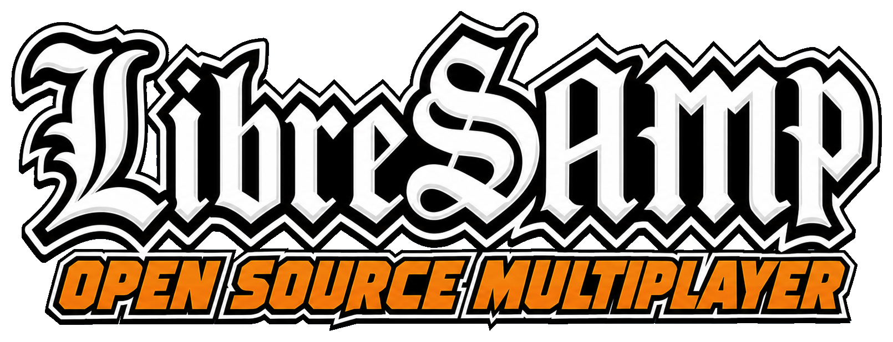
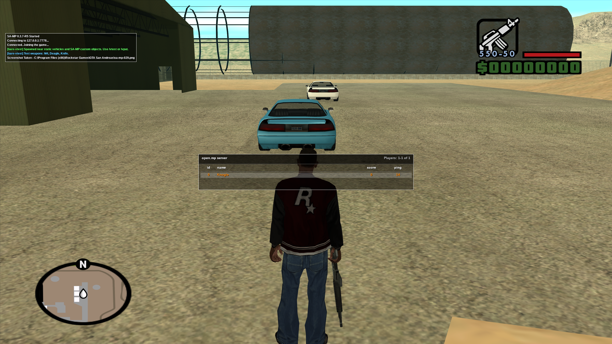
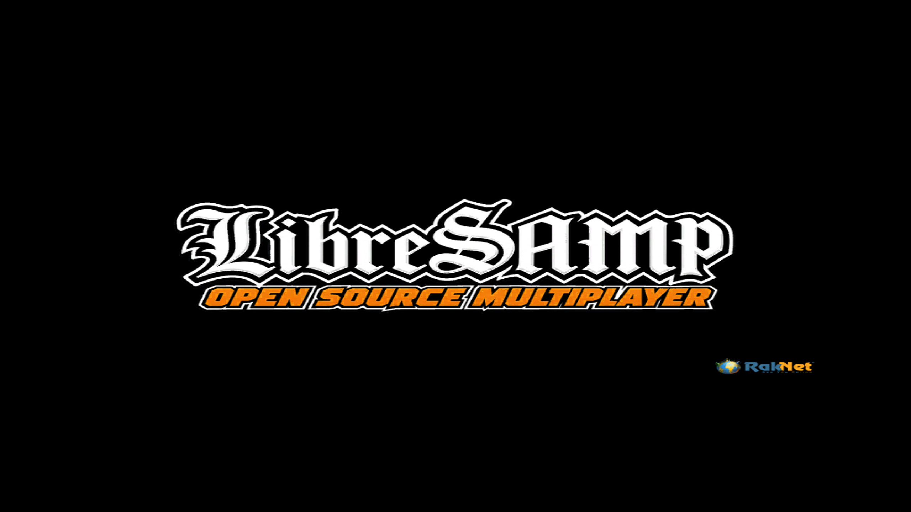
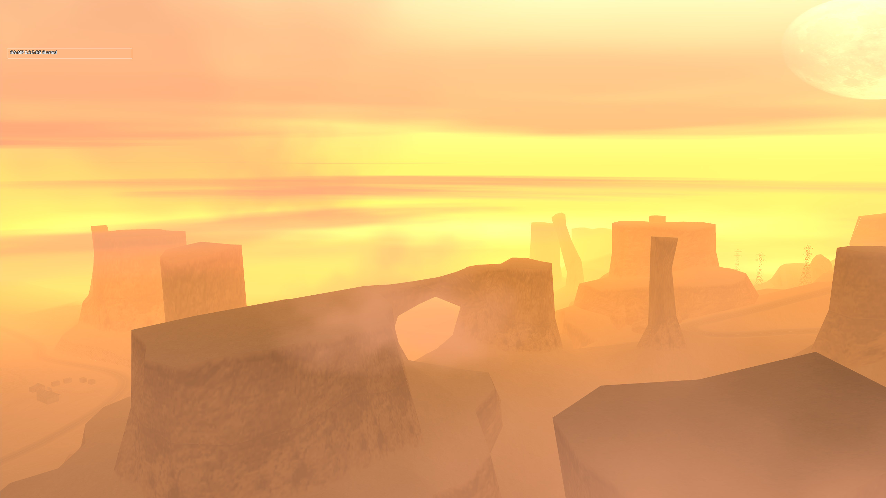
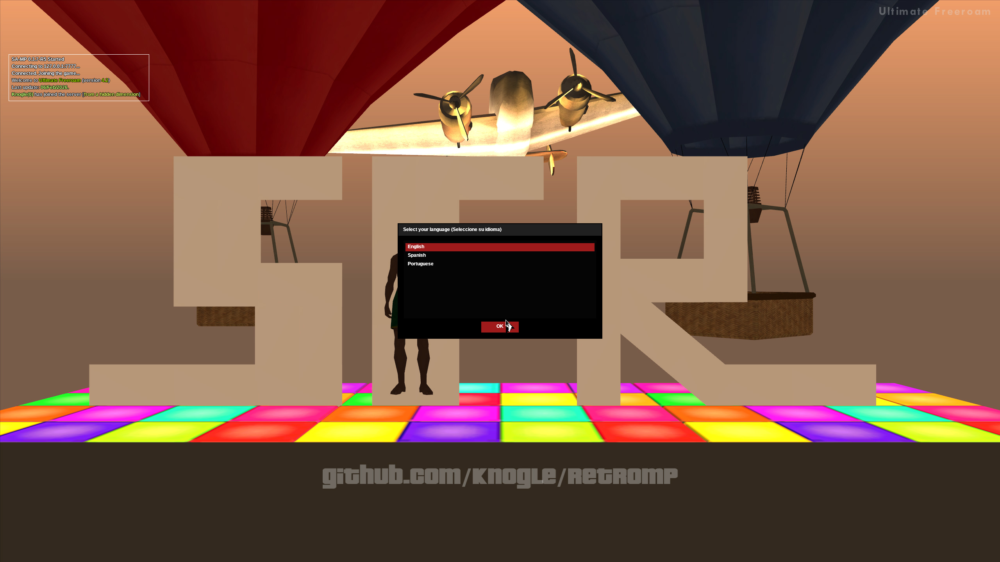
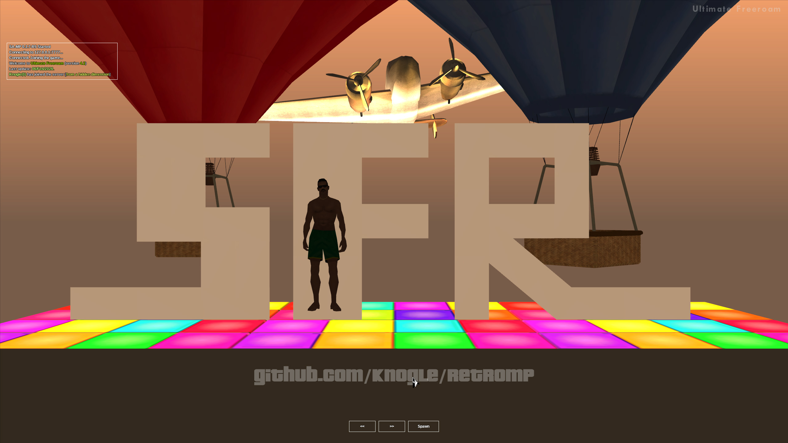
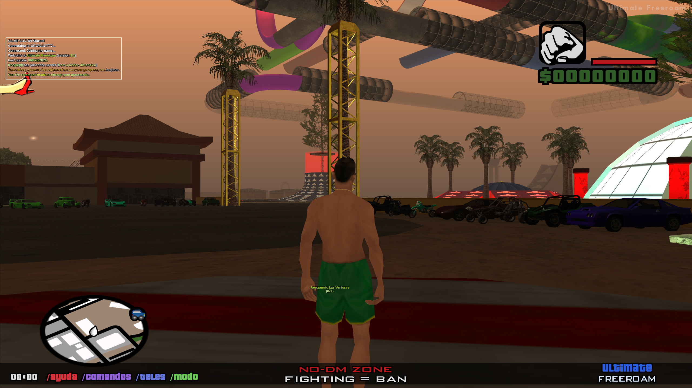

<div align="center">



# libsamp

**Libre-SAMP: compatibility-focused drop-in replacement for the SA-MP
0.3.7-R5 `samp.dll`.**

Runtime traces, original DLL reverse engineering, open.mp compatibility work,
and an ASI probe for reproducible client-side instrumentation.

[](https://github.com/Knogle/libsamp/actions/workflows/build.yml)
[](#current-status)
[](#what-it-is)
[](#build-from-source)
[](#build-from-source)
[](#github-actions)
[](tools/asi_probe)
[](https://github.com/Knogle/RakNet)
[](repo/RE_EVIDENCE_GUIDE.md)
[](#license)

<br>



</div>

---

## TL;DR

```sh
git clone --recurse-submodules https://github.com/Knogle/libsamp
cd libsamp

reimpl/scripts/build_win32.sh
tools/asi_probe/build_win32.sh
```

Build outputs:

- `build-win32/samp.dll`
- `build-asi-probe/samp_probe.asi`

The build ships the vendored [Knogle/RakNet](https://github.com/Knogle/RakNet)
submodule as the SA-MP/open.mp-compatible network transport source.

Use this only with local development servers and controlled test environments.
It is not a cheat, bypass, or public-server abuse toolkit.

## What It Is

libsamp, written out as Libre-SAMP, targets one concrete artifact: a compatible
drop-in replacement for the SA-MP 0.3.7-R5 client `samp.dll`.

The short-term runtime still expects an existing GTA San Andreas installation
with the SA-MP client files installed by the normal SA-MP installer. This
repository does not ship proprietary client assets, game files, or a complete
client distribution. The goal is to replace the DLL in that existing install
while preserving protocol and runtime compatibility with 0.3.7-compatible
servers, including open.mp compatibility paths.

The project is driven by observed behavior from the original DLL, ASI probe
golden traces, and public engine/protocol references. Proprietary binaries,
game assets, and local reverse-engineering workspaces are intentionally not
part of this repository.

## Current Status

Libre-SAMP has reached a playable compatibility milestone. The replacement now
boots GTA San Andreas, connects to tested local SA-MP 0.3.7/open.mp servers,
completes class selection and spawn, and runs feature-heavy legacy gamemodes.
The broad RPC gap pass for the currently agreed compatibility scope is largely
complete; development has moved into consolidation, regression testing, and
closer original-R5 parity work.

Implemented and exercised surfaces include:

- Loading and pre-connect presentation, RakNet join, class selection, spawn,
  death/F4 flows, GMX handling, and full connection-loss reset back to the
  pre-connect state.
- Chat, commands, fragmented dialogs and responses, menus, mouse mode, the TAB
  player list, player-pool updates, and core local/remote sync paths.
- GTA vehicles, actors, normal and SA-MP custom atomic objects, object movement,
  materials/material text, attachments, map icons, gang zones, checkpoints,
  3D labels, GameText, and building removal.
- SA-MP HUD and UI behavior, GTA CFont-backed TextDraws, Font 5 model previews,
  class selection, death window, weather/time, camera, spectating, player
  attributes, weapons, animations, and advanced vehicle RPCs.
- BASS-backed audio streams, GTA sound/scanner integration, attached-object and
  object editing with wire-compatible responses, plus bounds-checked RPC
  decoding and detailed runtime traces.

This is still a compatibility rebuild, not a byte-for-byte finished clone.
Current work is concentrated on:

- Golden-trace consolidation and repeatable original/replacement regression
  scenarios, including two-client and long-running sessions.
- Exact R5 presentation details such as attachment bone matrices, the original
  edit gizmo/camera behavior, scanner phrasing, and visual edge cases.
- Generic `samp.saa` ArchiveFS virtualization and remaining custom-asset
  streaming/material edge cases.
- Remote-player/vehicle interpolation, uncommon RPC and pool edge cases,
  defensive payload tests, and remaining pickup behavior.
- PE layout/import parity and other binary-surface differences that do not
  currently block the tested runtime milestone.

## Screenshots

Replacement-client snapshots from a local feature-heavy legacy gamemode run on
2026-07-18:

<table>
  <tr>
    <td width="50%">
      
      <br>
      <sub>Replacement DLL startup and loading-screen path.</sub>
    </td>
    <td width="50%">
      
      <br>
      <sub>Pre-connect panorama, status overlay, and session-ready state.</sub>
    </td>
  </tr>
  <tr>
    <td width="50%">
      
      <br>
      <sub>Server dialog rendering, selection, mouse input, and response flow.</sub>
    </td>
    <td width="50%">
      
      <br>
      <sub>Class selection, camera control, TextDraws, and custom object scene.</sub>
    </td>
  </tr>
  <tr>
    <td width="50%">
      
      <br>
      <sub>Vehicle pools, map objects, labels, HUD, radar, and world streaming.</sub>
    </td>
    <td width="50%">
      
      <br>
      <sub>Bare open.mp fixture with vehicles, custom objects, HUD, radar, and TAB player list.</sub>
    </td>
  </tr>
</table>

## Highlights

- Playable Win32 `samp.dll` drop-in rebuild with PE/export compatibility
  tracking and a broad, bounds-checked SA-MP RPC surface.
- Vendored Knogle/RakNet transport with join, reconnect, sync, dialog/menu, and
  client-to-server response paths for SA-MP/open.mp-oriented networking.
- GTA-SA runtime integration for players, vehicles, actors, objects and custom
  models, materials, world state, audio, cameras, HUD, TextDraws, dialogs,
  menus, labels, markers, and editing flows.
- Legacy lifecycle behavior covering loading, pre-connect, class selection,
  spawn/death, GMX, disconnect, and reconnect preparation.
- ASI probe included under [tools/asi_probe](tools/asi_probe) for repeatable
  instrumentation and golden trace collection.
- Evidence-tagged documentation model:
  `OBSERVED_037`, `PROBE_TRACE`, `STATIC_037`, `OPENMP_REF`,
  `GTA_REVERSED_REF`, `INFERRED`, and `TODO_VERIFY`.

## Build From Source

### Requirements

On Linux, install:

- CMake
- Ninja
- MinGW-w64 i686 GCC/G++
- Git submodule support

Fedora example:

```sh
sudo dnf install cmake ninja-build mingw32-gcc mingw32-gcc-c++
```

Debian/Ubuntu example:

```sh
sudo apt-get install cmake ninja-build gcc-mingw-w64-i686 g++-mingw-w64-i686
```

### Build The DLL

```sh
git submodule update --init --recursive
reimpl/scripts/build_win32.sh
```

This is the same public CI-style build used by GitHub Actions. It verifies the
DLL surface, runtime bridge, and vendored RakNet-backed network path without
depending on local-only reference workspaces.

### Build The ASI Probe

```sh
tools/asi_probe/build_win32.sh
```

The probe builds to `build-asi-probe/samp_probe.asi` and is loaded by a normal
ASI loader from the game root or an ASI loader search path.

## GitHub Actions

The repository contains a CI workflow at
[.github/workflows/build.yml](.github/workflows/build.yml). It builds:

- `samp.dll`
- `samp_probe.asi`
- `SHA256SUMS.txt`

The CI artifact build intentionally avoids proprietary inputs and local-only
reference paths. Runtime parity still depends on golden-trace verification.

## Documentation

- [Original public-milestone task tracker](repo/TASK_TRACKER.md)
- [Publication checklist](repo/PUBLICATION_CHECKLIST.md)
- [Reverse-engineering evidence guide](repo/RE_EVIDENCE_GUIDE.md)
- [Current RPC attachment/edit/crime/building pass](docs/re/rpc_attach_edit_crime_removebuilding_20260717.md)
- [Legacy feature gap matrix](docs/re/legacy_feature_gap_matrix_20260609.md)
- [TextDraw render stack notes](docs/re/textdraw_render_stack.md)
- [Custom asset pipeline notes](docs/re/samp_custom_asset_pipeline.md)
- [ASI probe README](tools/asi_probe/README.md)

## Scope And Safety

This project is for compatibility research, local testing, and preservation of
0.3.7-compatible client behavior. Do not use it to cheat, evade bans, bypass
server protections, or disrupt public servers.

Server-provided data is treated as untrusted. New RPC handlers should be
bounds-checked, fail closed, and log unknown behavior before implementing
unverified semantics.

## License

Libre-SAMP is licensed under the MIT License. See [LICENSE](LICENSE).

Third-party components and generated asset provenance are documented in
[NOTICE.md](NOTICE.md). The repository MIT License does not relicense
third-party submodules.

## Credits

- SA-MP and GTA-SA modding communities for protocol and engine knowledge.
- open.mp for public server-side compatibility references.
- gta-reversed for public GTA-SA engine research.
- Ultimate ASI Loader and related tooling for the ASI plugin ecosystem.
