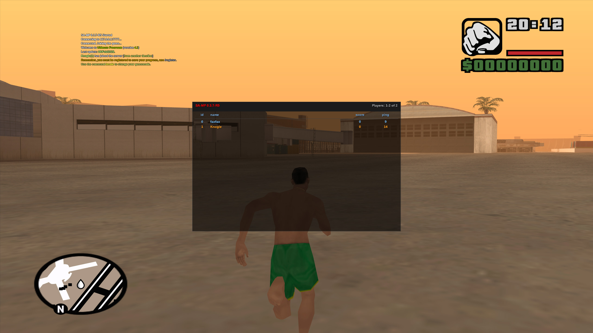

<div align="center">

# libsamp

**Libre-SAMP: experimental drop-in replacement for the SA-MP 0.3.7-R5
`samp.dll`.**

Runtime traces, original DLL reverse engineering, open.mp compatibility work,
and an ASI probe for reproducible client-side instrumentation.

[](https://github.com/Knogle/libsamp/actions/workflows/build.yml)
[](#current-status)
[](#what-it-is)
[](#build-from-source)
[](#build-from-source)
[](#github-actions)
[](tools/asi_probe)
[](https://github.com/Knogle/RakNet)
[](repo/RE_EVIDENCE_GUIDE.md)
[](#license)

<br>



</div>

---

## TL;DR

```sh
git clone --recurse-submodules https://github.com/Knogle/libsamp
cd libsamp

reimpl/scripts/build_win32.sh
tools/asi_probe/build_win32.sh
```

Build outputs:

- `build-win32/samp.dll`
- `build-asi-probe/samp_probe.asi`

The build ships the vendored [Knogle/RakNet](https://github.com/Knogle/RakNet)
submodule as the SA-MP/open.mp-compatible network transport source.

Use this only with local development servers and controlled test environments.
It is not a cheat, bypass, or public-server abuse toolkit.

## What It Is

libsamp, written out as Libre-SAMP, targets one concrete artifact: a compatible
drop-in replacement for the SA-MP 0.3.7-R5 client `samp.dll`.

The short-term runtime still expects an existing GTA San Andreas installation
with the SA-MP client files installed by the normal SA-MP installer. This
repository does not ship proprietary client assets, game files, or a complete
client distribution. The goal is to replace the DLL in that existing install
while preserving protocol and runtime compatibility with 0.3.7-compatible
servers, including open.mp compatibility paths.

The project is driven by observed behavior from the original DLL, ASI probe
golden traces, and public engine/protocol references. Proprietary binaries,
game assets, and local reverse-engineering workspaces are intentionally not
part of this repository.

## Current Status

This is not feature-complete. The current network-enabled development milestone
can connect, enter the gameplay state on tested local servers, handle
chat/dialog flows, spawn the local player, create vehicles, show core HUD/UI
elements, and render a growing subset of TextDraw behavior.

Known active work areas:

- Remote player sync, interpolation, nametags, and radar blips.
- Full RPC coverage with safe stubs and bounds-checked payload readers.
- SA-MP custom object loading and material handling.
- TextDraw parity for model previews, sprites, spacing, selection, and alpha.
- Vehicle sync details such as components, lock state, objective markers, and
  streaming budget.
- CI parity checks once public reference fixtures are available.

See [repo/TASK_TRACKER.md](repo/TASK_TRACKER.md) for the current task tracker.

## Screenshots

Current development snapshots from local compatibility runs:

<table>
  <tr>
    <td width="50%">
      
      <br>
      <sub>Gameplay state, HUD, chat, and world text rendering.</sub>
    </td>
    <td width="50%">
      
      <br>
      <sub>SA-MP-style dialog rendering during pre-connect flow.</sub>
    </td>
  </tr>
  <tr>
    <td width="50%">
      
      <br>
      <sub>Pre-connect panorama camera and status overlay.</sub>
    </td>
    <td width="50%">
      
      <br>
      <sub>Vehicles, local world streaming, and server-driven objects.</sub>
    </td>
  </tr>
  <tr>
    <td width="50%">
      
      <br>
      <sub>Custom loading screen asset path.</sub>
    </td>
    <td width="50%">
      
      <br>
      <sub>Player list overlay with local and remote player rows.</sub>
    </td>
  </tr>
</table>

## Highlights

- Win32 `samp.dll` drop-in rebuild with PE/export compatibility tracking.
- Vendored Knogle/RakNet transport path for SA-MP/open.mp-oriented networking.
- Runtime bridge for GTA-SA state, UI, dialogs, chat, TextDraws, vehicles, and
  basic world state.
- ASI probe included under [tools/asi_probe](tools/asi_probe) for repeatable
  instrumentation and golden trace collection.
- Evidence-tagged documentation model:
  `OBSERVED_037`, `PROBE_TRACE`, `STATIC_037`, `OPENMP_REF`,
  `GTA_REVERSED_REF`, `INFERRED`, and `TODO_VERIFY`.

## Build From Source

### Requirements

On Linux, install:

- CMake
- Ninja
- MinGW-w64 i686 GCC/G++
- Git submodule support

Fedora example:

```sh
sudo dnf install cmake ninja-build mingw32-gcc mingw32-gcc-c++
```

Debian/Ubuntu example:

```sh
sudo apt-get install cmake ninja-build gcc-mingw-w64-i686 g++-mingw-w64-i686
```

### Build The DLL

```sh
git submodule update --init --recursive
reimpl/scripts/build_win32.sh
```

This is the same public CI-style build used by GitHub Actions. It verifies the
DLL surface, runtime bridge, and vendored RakNet-backed network path without
depending on local-only reference workspaces.

### Build The ASI Probe

```sh
tools/asi_probe/build_win32.sh
```

The probe builds to `build-asi-probe/samp_probe.asi` and is loaded by a normal
ASI loader from the game root or an ASI loader search path.

## GitHub Actions

The repository contains a CI workflow at
[.github/workflows/build.yml](.github/workflows/build.yml). It builds:

- `samp.dll`
- `samp_probe.asi`
- `SHA256SUMS.txt`

The CI artifact build intentionally avoids proprietary inputs and local-only
reference paths. Runtime parity still depends on golden-trace verification.

## Documentation

- [Task tracker](repo/TASK_TRACKER.md)
- [Publication checklist](repo/PUBLICATION_CHECKLIST.md)
- [Reverse-engineering evidence guide](repo/RE_EVIDENCE_GUIDE.md)
- [TextDraw render stack notes](docs/re/textdraw_render_stack.md)
- [Custom asset pipeline notes](docs/re/samp_custom_asset_pipeline.md)
- [ASI probe README](tools/asi_probe/README.md)

## Scope And Safety

This project is for compatibility research, local testing, and preservation of
0.3.7-compatible client behavior. Do not use it to cheat, evade bans, bypass
server protections, or disrupt public servers.

Server-provided data is treated as untrusted. New RPC handlers should be
bounds-checked, fail closed, and log unknown behavior before implementing
unverified semantics.

## License

Libre-SAMP is licensed under the MIT License. See [LICENSE](LICENSE).

Third-party components and generated asset provenance are documented in
[NOTICE.md](NOTICE.md). The repository MIT License does not relicense
third-party submodules.

## Credits

- SA-MP and GTA-SA modding communities for protocol and engine knowledge.
- open.mp for public server-side compatibility references.
- gta-reversed for public GTA-SA engine research.
- Ultimate ASI Loader and related tooling for the ASI plugin ecosystem.
